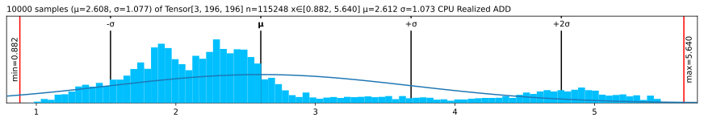
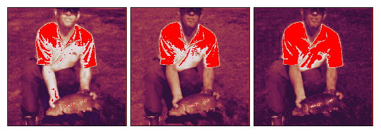

🫀 Lovely Grad
================

<!-- WARNING: THIS FILE WAS AUTOGENERATED! DO NOT EDIT! -->

<div>

## [Read full docs](https://xl0.github.io/lovely-grad) \| ❤️ [Lovely Tensors](https://github.com/xl0/lovely-tensors) \| 💘 [Lovely `JAX`](https://github.com/xl0/lovely-jax) \| 💟 [Lovely `NumPy`](https://github.com/xl0/lovely-numpy)

</div>

## Install

``` sh
pip install lovely-grad
```

or

// Coming soon //

``` sh
mamba install lovely-grad
```

or

``` sh
conda install -c conda-forge lovely-grad
```

## How to use

``` python
# Add this if you are running in a notebook ot tinygraad gets upset
import os; os.environ["DEBUG"] = "0"
```

How often do you find yourself debugging TinyGrad code? You dump a
tensor to the cell output, and see this:

``` python
numbers
```

    <Tensor <LB (3, 196, 196) dtypes.float op:LoadOps.FROMCPU st:ShapeTracker(shape=(3, 196, 196), views=[View((3, 196, 196), (38416, 196, 1), 0, None)])> on CPU with grad None>

Or this

``` python
numbers.numpy()
```

    array([[[-0.3541, -0.3369, ..., -0.4739,  2.2489],
            [-0.4054, -0.4226, ..., -0.8507,  2.1633],
            ...,
            [-0.8507, -0.7822, ..., -1.5014,  2.1804],
            [-0.8335, -0.8164, ..., -1.5528,  2.1119]],

           [[-0.1975, -0.1975, ..., -0.3725,  2.4111],
            [-0.25  , -0.2325, ..., -0.6702,  2.3585],
            ...,
            [-0.3901, -0.2325, ..., -1.2304,  2.4111],
            [-0.4076, -0.285 , ..., -1.2829,  2.341 ]],

           [[-0.6715, -0.9853, ..., -0.689 ,  2.396 ],
            [-0.7238, -1.0724, ..., -1.0201,  2.3263],
            ...,
            [-1.1944, -1.4559, ..., -1.4733,  2.4308],
            [-1.2293, -1.5256, ..., -1.5256,  2.3611]]], dtype=float32)

Was it really useful for you, as a human, to see all these numbers?

What is the shape? The size?  
What are the statistics?  
Are any of the values `nan` or `inf`?

### Is it an image of a man holding a tench?

``` python
from lovely_grad import monkey_patch; monkey_patch()
```

## Summary

``` python
numbers
```

    Tensor[3, 196, 196] n=115248 x∈[-2.118, 2.640] μ=-0.388 σ=1.073 CPU

Better, huh?

``` python
numbers[1,:6,1] # Still shows values if there are not too many.
```

    Tensor[6] x∈[-0.443, -0.197] μ=-0.311 σ=0.091 CPU Realized RESHAPE [-0.197, -0.232, -0.285, -0.373, -0.443, -0.338]

``` python
spicy = numbers[0,:12,0].numpy() # Please add native support for this.
spicy[0] *= 10000.0
spicy[1] /= 10000.0
spicy[3] = np.Inf
spicy[4] = np.NINF
spicy[5] = np.NaN
spicy = Tensor(spicy).reshape(2,6)

spicy # Spicy stuff
```

    Tensor[2, 6] n=12 x∈[-3.541e+03, -4.054e-05] μ=-393.827 σ=1.113e+03 +Inf! -Inf! NaN! CPU Realized RESHAPE

``` python
Tensor.zeros(10, 10) # A zero tensor - make it obvious
```

    Tensor[10, 10] n=100 all_zeros CPU Realized CONTIGUOUS

``` python
spicy += 1 # Make ot lazy again
spicy.p # The plain old way
```

    <Tensor <LB (2, 6) dtypes.float op:BinaryOps.ADD st:ShapeTracker(shape=(2, 6), views=[View((2, 6), (6, 1), 0, None)])> on CPU with grad None>

``` python
spicy.v # Verbose
```

    <Tensor <LB (2, 6) dtypes.float op:BinaryOps.ADD st:ShapeTracker(shape=(2, 6), views=[View((2, 6), (6, 1), 0, None)])> on CPU with grad None>
    Tensor[2, 6] n=12 x∈[-3.540e+03, 1.000] μ=-392.827 σ=1.113e+03 +Inf! -Inf! NaN! CPU Realized ADD

## But I want to be lazy!

``` python
from lovely_grad import set_config
from lovely_grad import config # This is a context manager by the way.
```

``` python
set_config(auto_realize=False)
s = spicy+1
s # No realization
```

    Tensor[2, 6] n=12 CPU Lazy ADD

``` python
s # still lazy
```

    Tensor[2, 6] n=12 CPU Lazy ADD

``` python
set_config(auto_realize=True)
s # Will realize
```

    Tensor[2, 6] n=12 x∈[-3.539e+03, 2.000] μ=-391.827 σ=1.113e+03 +Inf! -Inf! NaN! CPU Realized ADD

``` python
s # Already realized
```

    Tensor[2, 6] n=12 x∈[-3.539e+03, 2.000] μ=-391.827 σ=1.113e+03 +Inf! -Inf! NaN! CPU

## Going `.deeper`

``` python
numbers.deeper
```

    Tensor[3, 196, 196] n=115248 x∈[-2.118, 2.640] μ=-0.388 σ=1.073 CPU
      Tensor[196, 196] n=38416 x∈[-2.118, 2.249] μ=-0.324 σ=1.036 CPU
      Tensor[196, 196] n=38416 x∈[-1.966, 2.429] μ=-0.274 σ=0.973 CPU
      Tensor[196, 196] n=38416 x∈[-1.804, 2.640] μ=-0.567 σ=1.178 CPU

``` python
# You can go deeper if you need to
numbers[:,:3,:5].deeper(2)
```

    Tensor[3, 3, 5] n=45 x∈[-1.316, -0.197] μ=-0.593 σ=0.306 CPU Realized SHRINK
      Tensor[3, 5] n=15 x∈[-0.765, -0.337] μ=-0.492 σ=0.124 CPU
        Tensor[5] x∈[-0.440, -0.337] μ=-0.385 σ=0.041 CPU [-0.354, -0.337, -0.405, -0.440, -0.388]
        Tensor[5] x∈[-0.662, -0.405] μ=-0.512 σ=0.108 CPU [-0.405, -0.423, -0.491, -0.577, -0.662]
        Tensor[5] x∈[-0.765, -0.474] μ=-0.580 σ=0.125 CPU [-0.474, -0.474, -0.542, -0.645, -0.765]
      Tensor[3, 5] n=15 x∈[-0.513, -0.197] μ=-0.321 σ=0.099 CPU
        Tensor[5] x∈[-0.303, -0.197] μ=-0.243 σ=0.055 CPU [-0.197, -0.197, -0.303, -0.303, -0.215]
        Tensor[5] x∈[-0.408, -0.232] μ=-0.327 σ=0.084 CPU [-0.250, -0.232, -0.338, -0.408, -0.408]
        Tensor[5] x∈[-0.513, -0.285] μ=-0.394 σ=0.102 CPU [-0.303, -0.285, -0.390, -0.478, -0.513]
      Tensor[3, 5] n=15 x∈[-1.316, -0.672] μ=-0.964 σ=0.176 CPU
        Tensor[5] x∈[-0.985, -0.672] μ=-0.846 σ=0.123 CPU [-0.672, -0.985, -0.881, -0.776, -0.916]
        Tensor[5] x∈[-1.212, -0.724] μ=-0.989 σ=0.179 CPU [-0.724, -1.072, -0.968, -0.968, -1.212]
        Tensor[5] x∈[-1.316, -0.828] μ=-1.058 σ=0.179 CPU [-0.828, -1.125, -1.020, -1.003, -1.316]

## Now in `.rgb` color

The important queston - is it our man?

``` python
numbers.rgb
```


*Maaaaybe?* Looks like someone normalized him.

``` python
in_stats = ( (0.485, 0.456, 0.406),     # mean 
             (0.229, 0.224, 0.225) )    # std

# numbers.rgb(in_stats, cl=True) # For channel-last input format
numbers.rgb(in_stats)
```


It’s indeed our hero, the Tenchman!

## `.plt` the statistics

``` python
(numbers+3).plt
```


``` python
(numbers+3).plt(center="mean", max_s=1000)
```



``` python
(numbers+3).plt(center="range")
```


## See the `.chans`

``` python
# .chans will map values betwen [-1,1] to colors.
# Make our values fit into that range to avoid clipping.
mean = Tensor(in_stats[0])[:,None,None]
std = Tensor(in_stats[1])[:,None,None]
numbers_01 = (numbers*std + mean)
numbers_01
```

    Tensor[3, 196, 196] n=115248 x∈[0., 1.000] μ=0.361 σ=0.248 CPU Realized ADD

``` python
numbers_01.chans
```


Let’s try with a Convolutional Neural Network

``` python
import torch
import tinygrad.nn as nn
```

``` python
class VGG_top:
    """Top 6 layers (until 3rd conv) of VGG"""

    def __init__(self, weights=None):
        self.layers = [
            nn.Conv2d(3, 64, kernel_size=3, stride=1, padding=1, bias=True),
            Tensor.relu,
            Tensor.max_pool2d,
            nn.Conv2d(64, 128, kernel_size=3, stride=1, padding=1, bias=True),
            Tensor.relu,
            Tensor.max_pool2d,
        ]
        if weights:
            self.layers[0].weight = Tensor(weights["0.weight"].numpy())
            self.layers[0].bias = Tensor(weights["0.bias"].numpy())
            self.layers[3].weight = Tensor(weights["3.weight"].numpy())
            self.layers[3].bias = Tensor(weights["3.bias"].numpy())            

    def __call__(self, x: Tensor):
        return x.sequential(self.layers)
```

``` python
tg_vgg = VGG_top(torch.load("features.pt"))
```

``` python
acts = tg_vgg(numbers[None])/2
acts
```

    Tensor[1, 128, 49, 49] n=307328 x∈[0., 12.508] μ=0.367 σ=0.634 CPU Realized MUL

``` python
acts[0,:4].chans(cmap="coolwarm", scale=4)
```


## Grouping

``` python
# Make 8 images with progressively higher brightness and stack them 2x2x2.
eight_images = (Tensor.stack([numbers]*8) + Tensor(np.linspace(-2, 2, 8).astype(np.float32)).reshape(8,1,1,1))
eight_images = (eight_images
                    .mul(Tensor(in_stats[1]).reshape(1,3,1,1))
                    .add(Tensor(in_stats[0]).reshape(1,3,1,1))
                    .clip(0,1)
                    .reshape(2,2,2,3,196,196)
)
eight_images
```

    Tensor[2, 2, 2, 3, 196, 196] n=921984 x∈[0., 1.000] μ=0.382 σ=0.319 CPU Realized RESHAPE

``` python
eight_images.rgb
```


``` python
# Weights of the second conv layer of VGG11
tg_vgg.layers[3].weight
```

    Tensor[128, 64, 3, 3] n=73728 x∈[-0.783, 0.776] μ=-0.004 σ=0.065 CPU

I want +/- 2σ to fall in the range \[-1..1\]

``` python
weights = tg_vgg.layers[3].weight
weights = weights / (2*2*weights.std()) # *2 because we want 2σ on both sides, so 4σ
# weights += weights.std() * 2
weights.plt
```


``` python
# Weights of the second conv layer (64ch -> 128ch) of VGG11,
# grouped per output channel.
weights.chans(frame_px=1, gutter_px=0)
```


It’s a bit hard to see. Scale up 10x, but onyl show the first 4 filters.

``` python
weights[:4].chans(frame_px=1, gutter_px=0, scale=10)
```


## Options \| [Docs](https://xl0.github.io/lovely-tensors/utils.config.html)

``` python
import lovely_grad as lg
```

``` python
lg.set_config(precision=1, sci_mode=True, color=False)
Tensor([1, 2, float("NaN")])
```

    Tensor[3] μ=1.5e+00 σ=5.0e-01 NaN! CPU Realized FROMCPU [1.0e+00, 2.0e+00, nan]

``` python
lg.set_config(precision=None, sci_mode=None, color=None) # None -> Reset to defaults
```

``` python
print(Tensor([1., 2]))
# Or with config context manager.
with lg.config(sci_mode=True, precision=5):
    print(Tensor([1., 2]))

print(Tensor([1., 2]))
```

    Tensor[2] μ=1.500 σ=0.707 CPU Realized FROMCPU [1.000, 2.000]
    Tensor[2] μ=1.50000e+00 σ=7.07107e-01 CPU Realized FROMCPU [1.00000e+00, 2.00000e+00]
    Tensor[2] μ=1.500 σ=0.707 CPU Realized FROMCPU [1.000, 2.000]

## Without `.monkey_patch`

``` python
lg.lovely(spicy)
```

    Tensor[2, 6] n=12 x∈[-3.540e+03, 1.000] μ=-392.827 σ=1.113e+03 +Inf! -Inf! NaN! CPU

``` python
lg.lovely(spicy, verbose=True)
```

    <Tensor buffer<12, dtypes.float> on CPU with grad None>
    Tensor[2, 6] n=12 x∈[-3.540e+03, 1.000] μ=-392.827 σ=1.113e+03 +Inf! -Inf! NaN! CPU

``` python
lg.lovely(numbers, depth=1)
```

    Tensor[3, 196, 196] n=115248 x∈[-2.118, 2.640] μ=-0.388 σ=1.073 CPU
      Tensor[196, 196] n=38416 x∈[-2.118, 2.249] μ=-0.324 σ=1.036 CPU
      Tensor[196, 196] n=38416 x∈[-1.966, 2.429] μ=-0.274 σ=0.973 CPU
      Tensor[196, 196] n=38416 x∈[-1.804, 2.640] μ=-0.567 σ=1.178 CPU

``` python
lg.rgb(numbers, in_stats)
```


``` python
lg.plot(numbers, center="mean")
```

    AttributeError: module 'lovely_grad' has no attribute 'plot'

``` python
lg.chans(numbers_01)
```


## Matplotlib integration \| [Docs](https://xl0.github.io/lovely-tensors/matplotlib.html)

``` python
numbers.rgb(in_stats).fig # matplotlib figure
```



``` python
(numbers*0.3+0.5).chans.fig # matplotlib figure
```


``` python
numbers.plt.fig.savefig('pretty.svg') # Save it
```

``` python
!file pretty.svg; rm pretty.svg
```

    pretty.svg: SVG Scalable Vector Graphics image

### Add content to existing Axes

``` python
fig = plt.figure(figsize=(8,3))
fig.set_constrained_layout(True)
gs = fig.add_gridspec(2,2)
ax1 = fig.add_subplot(gs[0, :])
ax2 = fig.add_subplot(gs[1, 0])
ax3 = fig.add_subplot(gs[1,1:])

ax2.set_axis_off()
ax3.set_axis_off()

numbers_01.plt(ax=ax1)
numbers_01.rgb(ax=ax2)
numbers_01.chans(ax=ax3);
```


